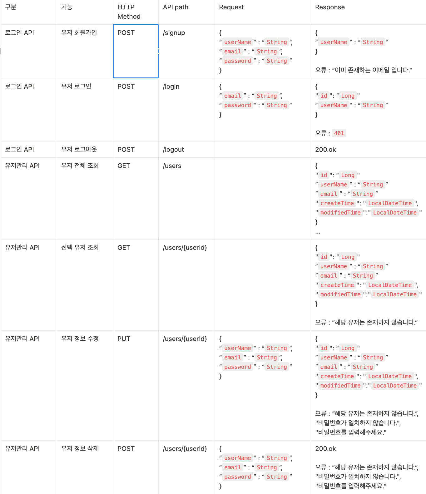
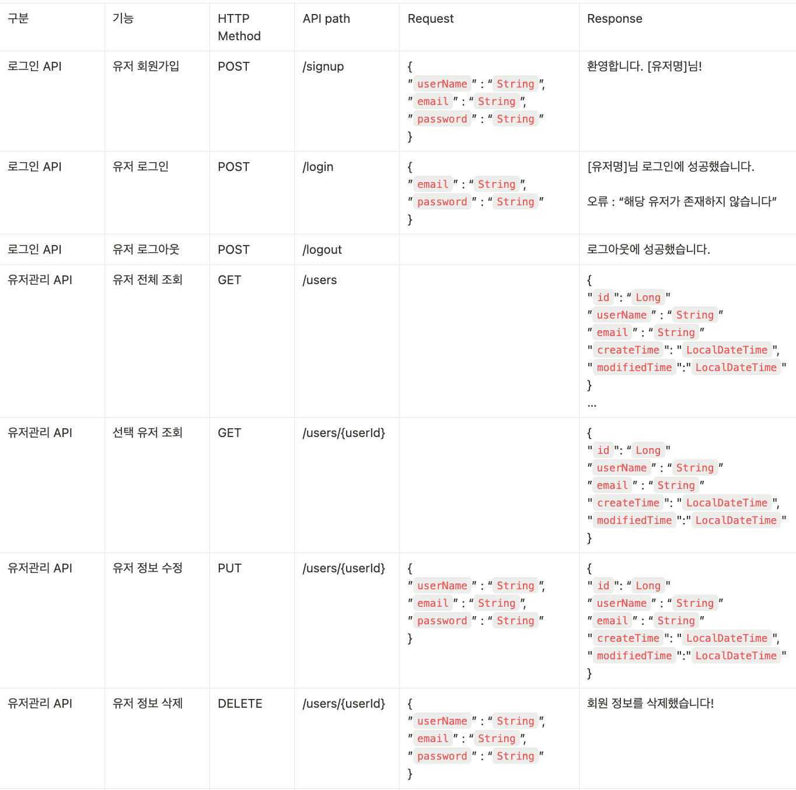
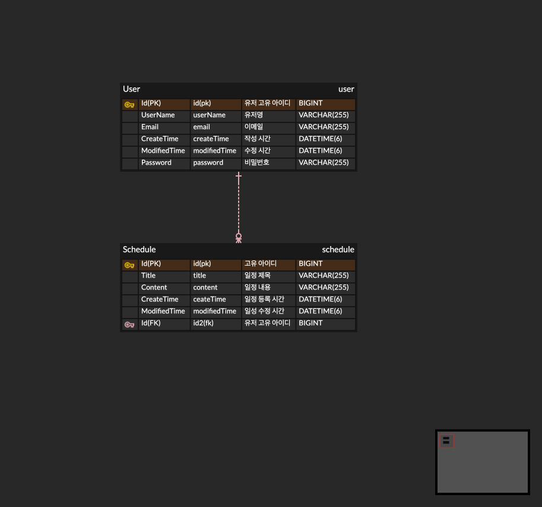

    일정 관리 앱
프로젝트 개요
- 프로젝트 목적: 3 Layer Architecture(Controller, Service, Repository)를 적용하여 만드는 일정 관리 앱을 만들기
- 주요 학습 목표: 
  - 3 Layer Architecture(Controller, Service, Repository)의 개념 이해와 상황에 맞는 어노테이션(@..)을 잘 활용하기
  - JPA를 활용한 데이터베이스 관리 → CRUD에 대한 구조 이해
  - Cookie/Session을 활용한 인증/인가 → 보안 개념과 인증 메커니즘 이해

기술 스택
- Language: Java 17
- IDE: IntelliJ IDEA
- POSTMAN, MySQL

API 명세서
- API 이름: ScheduleManagement
- URL: [http://localhost:8080/users](http://localhost:8080/users)
- 응답 형식: 주로 JSON 형식으로 설명.
- 오류 메시지 형식: “해당 유저가 존재하지 않습니다”

ERD

Lv1 주요 기능
- 일정 생성
- 일정 전체 조회 (or 작성자를 기준으로 조회)
- 일정 단건 조회 (고유 식별자 Id로 조회)
- 일정 수정 (고유 식별자 Id로 찾은 후 일정 제목과 작서자명만 수정) 
- 일정 삭제 (고유 식별자 Id로 찾은 후 삭제) 

Lv2 주요 기능
- 유저 생성
- 유저 전체 조회 
- 유저 단건 조회 (고유 식별자 Id로 조회)
- 유저 수정 (고유 식별자 Id로 찾은 후 일정 제목과 작서자명만 수정) 
- 유저 삭제 (고유 식별자 Id로 찾은 후 삭제) 
- 연관 관계 구현 후 일정 필드에 존재하는 유저명을 제거 및 유저 고유 아이디 추가

Lv3 주요 기능
- 기존에 존재하는 기능과 더불어 유저 필드에 비밀번호를 추가하여 활용
- 일정 수정 (고유 식별자 Id로 찾은 후 일정 제목과 작서자명만 수정) 로그인을 하고 수정하기 때문에 비밀번호 검증 제외
- 일정 삭제 (고유 식별자 Id로 찾은 후 비밀번호 매칭 후 삭제) 삭제는 데이터를 제거하는 것이기 때문에 비밀번호 검증 한번 더 검증
- 유저 수정 (고유 식별자 Id로 찾은 후 일정 제목과 작서자명만 수정) 로그인을 하고 수정하기 때문에 비밀번호 검증 제외
- 유저 삭제 (고유 식별자 Id로 찾은 후 비밀번호 매칭 후 삭제) 삭제는 데이터를 제거하는 것이기 때문에 비밀번호 검증 한번 더 검증

Lv4 주요 기능
- Cookie/Session을 활용해 로그인 기능을 구현
- 필터를 활용해 인증 처리
- @Configuration 을 활용해 필터를 등록
- 이메일과 비밀번호를 활용해 로그인 기능을 구현 (유저 생성(등록) 기능 주석처리)
- 회원가입, 로그인 요청은 인증 처리에서 제외
- 로그인 시 이메일과 비밀번호가 일치하지 않을 경우 HTTP Status code 401을 반환

패키지 구조

실행 방법
- ScheduleManagementApplication 실행 후 포스트맨을 연동하여 각 기능의 맞는 입력 값을 입력 후 저장 및 출력 확인

트러블슈팅
https://byeongsu.tistory.com/53
